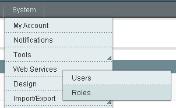
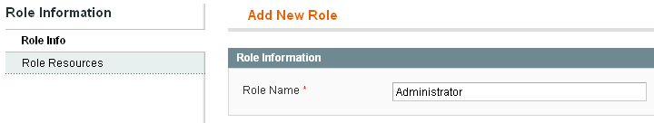
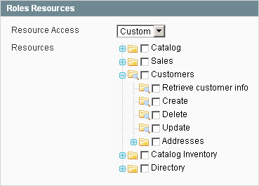
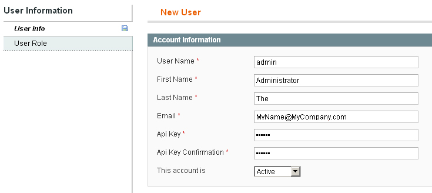
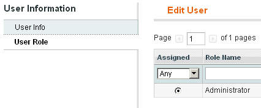
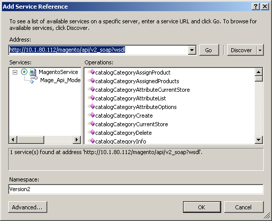
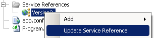
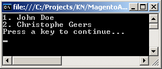

# Using The Magento Core API With WCF

## Introduction

[Magento](http://www.magentocommerce.com/) is a PHP based open-source e-commerce web application which launched back in 2008. Created by [Varien](http://www.varien.com/), based on the [Zend Framework](http://framework.zend.com/), it quickly became one of the most popular e-commerce platforms.

This article is not a primer on Magento, thus a basic understanding of its inner workings is advisable. Knowledge of PHP is not required, but you should at least have a Magento installation up and running.

At the time of this writing I am using the [Magento Community Edition version 1.3.2.4](http://www.magentocommerce.com/download/noregister) and I've inserted the [sample data version 1.2.0](http://www.magentocommerce.com/download/noregister) into its database.

The default installation of Magento comes bundled with a web services API, called the [Magento Core API](http://www.magentocommerce.com/support/magento_core_api). This API allows interaction of third party applications with several sets of core data. You can either use SOAP or XML RPC protocols to communicate with the Magento API.

This is great for example if you want to build applications to manage Magento's customers, orders, products...etc. You can write your own back-end application instead of using Magento's default Admin Panel. You can also opt to import data into Magento's database when migrating from another e-commerce platform. The API provides for countless other possibilities to meet your business needs.

This article focuses on communicating with the Magento Core API from .NET's Windows Communication Foundation (WCF). So let's get started...

## Getting Started With Magento

The following books are available for those of you looking to get started with Magento:

- [Magento Beginner's Guide](http://www.packtpub.com/magento-beginners-guide/book) (Packt Publishing)
- [Magento 1.3: PHP Developer's Guide](http://www.packtpub.com/magento-1-3-php-developers-guide/book) (Packt Publishing)
- [Magento 1.3 Theme Design](http://www.packtpub.com/magento-1-3-theme-design/book) (Packt Publishing)
- [Magento 1.3 Sales Tactics Cookbook](http://www.packtpub.com/magento-1-3-sales-tactics-cookbook/book) (Packt Publishing)
- [Guide to E-commerce Programming with Magento](http://www.phparch.com/books/isbn/9780973862171) (php|architect)
- [The Definitive Guide to Magento](http://www.apress.com/book/view/1430272295) (Apress)
- [Pro Magento Developer’s Guide](http://www.apress.com/book/view/1430227990) (Apress)

Most of these books, if not all of them, are available as an eBook (PDF). Be sure to check out the table of contents before purchasing a book. Some of them concentrate more on learning to work with Magento's Admin Panel rather than on programming with Magento to build custom extensions using PHP. I recommend getting a beginner's guide and a more technical savy book.

Programming with Magento can be daunting and confusing at first, but just dive into the deep end and start writing your own custom extensions (modules) following one of the examples you'll find in these books. You'll get the hang of it as you go along.

## Script Access To The Magento Core API

Before you can access Magento's Core API you need to setup an authorized API user. This involves creating a role, assigning rights (or resources) to that role and finally creating a user account and subscribing it to the previously created role.

Open your browser and log into the Magento Admin Panel (e.g.: http://localhost/magento/admin). Next go to **System > Web Services > Roles** as seen in the following screenshot.

**Figure 1** - System > Web Services > Roles



For a default Magento installation you'll see an empty table of roles. Click on the **Add New Role** button displayed in the upper right corner to start creating a new role.

**Figure 2** - Add New Role

](images/magento2.jpg)

Creating a new role is a two-step operation. First you need to enter a name for the role. Call this role "**Administrator**"

**Figure 3** - Role Info



Next click on the tab Role Resources as seen in the previous screenshot. Here you need to assign which resources are available for the new role.

**Figure 4** - Role Resources



If you choose "Custom" for the option Resource Access then you are able to individually select the resources for the role as shown in Figure 4. The list of resources is quite exhaustive. Instead of checking each option just choose "All" for the Resource Access option. This is the same as checking each resource and gives the role access to every resource available. To save the new role click on the **Save Role** button displayed in the upper right corner.

Now you need to create a new user account. Go to **System > Web Services > Users** and click on the "**Add New User**" button in the upper right corner of the screen.

**Figure 5** - New User



As you can see creating a new user account is also a two-step operation. First you need to enter the user's personal information such as username, e-mail address, firstname, lastname and an **Api Key**. Remember the value for the Api Key as you'll need it in order to use Magento's Core API. Fill in the information for your user account as seen in Figure 5.

Once this form is filled in proceed to the **User Role** section by selecting this option from the menu on the left of the screen. Check the role "Administrator" and click on the **Save User** button to create the user account.

**Figure 6** - User Role



Voila, that concludes setting up an authorized API user.

## The Magento Core API

The Magento API consists out of 18 API's which allow you to manage resources ranging from customers, categories, products, orders, shipments, invoices...etc.

These API's are gathered into the following groups:

- **Customer**: Manage the customer, customer groups and customer address resources
- **Directory**: Manage the country and region resources
- **Catalog**: Manage the category, category attributes, product, product attributes, product attribute sets, product types, product images, product tier price and product links resources
- **Sales**: Manage the order, shipment, invoice and inventory resources

If you search the Magento documentation for the location (= webservice URL) of the API you'll soon find out that it is http://localhost/magento/api/soap?wsdl. Ofcourse you'll need to replace the htpt://localhost/magento part with the location where you installed your copy of Magento.

If you enter this URL in your favorite browser then you should get a nice view of the service's WSDL. The following list is not exhaustive, but contains the most important operations of the service.

**Listing 1** - Magento API Service Operations

- **string startSession()**: starts an API session and returns a session id
- **bool endSession(sessionId)**: ends an API session
- **string login(apiUser, apiKey)**: starts an API session, authorizes a user and returns a session id
- **mixed call(sessionId, resourcePath, array arguments)**: performs an operation on the resource specified by the resource path for a certain session
- **array resources(sessionId)**: returns a list of resources and methods you are allowed to call during the current session

Looking at these service operations you can deduce that in order to perform operations on one of Magento's resources you need to start a session. After starting a session by calling startSession() or login(...) you'll receive a session id. This session id needs to be passed to every subsequent call.

**Remark**: Call startSession() if you don't require authorization for a certain resource. Use the login(...) operation however if authorization is required! In most cases you'll wind up using the login(...) operation.

If you want to perform an operation against one of Magento's resources you'll have to use the call(...) operation. Consider the following code sample:

**Listing 2** - Performing An Acttion On A Resource

```csharp
string sessionId = proxy.login("your_username", "your_api_key");
var customers = proxy.call(sessionId, "resource.method", null)
proxy.endSession(sessionId);
```

The second parameter of the call method is where you specify which operation you want to perform and on which of Magento's resources. This takes the form resource.method. So for example if you want to retrieve a list of customers, you specify customer.list. The third parameter can be used to pass an array of optional parameters. If you want to create a new customer (resource: customer.create) this is where you pass the customer's data (first -and lastname, password hash...etc.).

So every action you want to perform on one of Magento's resources is done through this magic call operation. This works, but is weak typed. You have to specify the desired resource and the method you want to perform against it by passing them in as a string and you can easily wind up with a large amount of parameters depending on the method you are calling (list, create, update, delete...etc.). Any typo's you make will only show up at runtime and not at design time.

If you insist on using this system my advice is to create your own API which is strong typed and hides these ugly implementation details for you. The [facade pattern](http://en.wikipedia.org/wiki/Facade_pattern) might qualify here.

Oh, and did I forget to mention that this SOAP API does NOT work well in Visual Studio? Visual Studio has wonderful support for SOAP but Magento's API is not compliant. Luckily as of version 1.3 Magento has a second WSDL with better support for .NET (or Java if you like). The new version can be found here:

http://localhost/magento/api/v2_soap?wsdl

This version contains a service operation for each of the methods that you can call on any of Magento's resources and most of these methods don't require an array of parameters but use other types as declared in the WSDL. This solves the issues with the weakly typed version and provides us with a strong typed alternative.

Unfortunately this version also has some compatability problems, but you can easily correct them by "hacking" some of Magento's core files. The next section explains how this can be achieved.

## Generating A Proxy

Finally we get to the .NET part of this article. Let's start by having WCF generate a proxy for us. Start up Visual Studio 2008 and create a new blank solution called MagentoApi.

Next add a Console Application project, creatively named ConsoleApplication, to this solution. Then add a service reference to this project and enter the URL (WSDL) for version 2 of Magento's SOAP.

**Figure 7** - Add Service Reference



And now WCF uses its magic and generates a working proxy for you! Well, actually it doesn't. Instead you'll receive the error message "Failed to generate code for the service reference.".

**Figure 8** - Failed To Generate Code


Guess what? The WSDL contains a typo, once corrected the code generation will work correctly. It took alot of searching to find out where this error was located. The definition for Magento's WSDL is not located in one place, but spread across several of its modules.

If you are familiar with how Magento organizes its modules, then you know that the core modules are located in the **app\\code\\core\\Mage** directory. Each folder inside this directory represents a module. The core part of the API module is located in the Api directory.

If you take a look at the Config.php source file located in the **app\\code\\code\\Mage\\Api\\Model\\Wsdl** directory you'll find the following init function().

**Listing 3** - Assembling Magento's WSDL

```php
public function init()
{
    // ...

    $mergeWsdl = new Mage_Api_Model_Wsdl_Config_Base();
    $mergeWsdl->setHandler($this->getHandler());

    $mergeWsdl->addLoadedFile(Mage::getConfig()->getModuleDir('etc', "Mage_Api").DS.'wsdl.xml');

    $baseWsdlFile = Mage::getConfig()->getModuleDir('etc', "Mage_Api").DS.'wsdl2.xml';
    $this->loadFile($baseWsdlFile);
    Mage::getConfig()->loadModulesConfiguration('wsdl.xml', $this, $mergeWsdl);

    // ...
}
```

Listing 3 does not show the entire code for the init() function. Only the part that concerns us is included. You can see that Magento loads a base WSDL file called wsdl2.xml and loads a wsdl.xml file for each of its modules that contain such a file. The Magento API is extensible and you can build your own module that extends it. All of these wsdl.xml files are finally merged together. Luckily the result is cached for subsequent requests.

So now we need to find out which module extends the Api and contains the typo that is preventing Visual Studio from generating the proxy. I'll give you a hint, it's located in the Catalog module. Go to the configuration directory of this module (app\\code\\core\\Mage\\Catalog\\etc) and there you'll find a wsdl.xml file. Open it in an Xml editor and locate the part seen in the following listing.

**Listing 4** - Catalog Module WSDL

```xml
<message name="catalogProductGetSpecialPriceRequest">
    <part name="sessionId" type="xsd:string" />
    <part name="product" type="xsd:string" />
    <part name="storeView " type="xsd:string" />
</message>
```

As you can see the last part of this message named **storeView** contains the mistake. An extra whitespace character is trailing at the end of the name attribute. Just remove it and save the file. Now return to Visual Studio, right click on the previously added service reference from inside the solution explorer and select "**Update Service Reference**".

**Update**: On February 12th, 2010 Varien released the Magento Community Edition 1.4.0.0. In this version this typo' has been corrected.

**Figure 9** - Update Service Reference



Visual Studio will now correctly generate the proxy code. If you still receive an error it's due to the fact that Magento cached the WSDL it merged together and is still serving this version. Just delete Magento's cache by deleting everything in the **var/cache** directory and try again.

**Remark**: For most of you this is all you are required to do in order to get the Magento API to work with WCF. However depending on the network you are connected to, you might receive the following error when calling one of the service's operations.

_Fatal error: Uncaught SoapFault exception: \[WSDL\] SOAP-ERROR: Parsing Schema: can't import schema from 'http://schemas.xmlsoap.org/soap/encoding/_

Everytime you a make a request to the API, Magento will fire up a SOAP server using PHP's build-in SOAP support. It does so using the [PHP's SoapServer class](http://be2.php.net/manual/en/class.soapserver.php). The constructor of this class requires the URI of the WSDL file. Constructing the soap server will eventually blow up and result in the aforementioned error message. The WSDL file contains an import for an XSD schema located at http://schemas.xmlsoap.org/soap/encoding/.

To solve this you need to remove the following line from every wsdl.xml file found in Magento's core modules:

```xml
<import namespace="http://schemas.xmlsoap.org/soap/encoding/" schemaLocation="http://schemas.xmlsoap.org/soap/encoding/" />
```

Another way of solving this error is downloading this schema and referencing this local XSD file instead of the remote one. This means you have to adjust the schemaLocation attribute for every wsdl.xml file found in Magento's core modules.

Then clear Magento's cache and you are ready to go.

## Client Application

Voila, now that everything is in place we can begin to work with the Magento Core API. Let’s test this by retrieving a list of all the customers that are registered in Magento's database.

Add the code shown in Listing 5 to the Main(...) method of the ConsoleApplication project.

**Listing 5** - ConsoleApplication's Main(...) method

```csharp
using (Mage_Api_Model_Server_V2_HandlerPortTypeClient proxy = new Mage_Api_Model_Server_V2_HandlerPortTypeClient())
{
    string sessionId = proxy.login("your_username", "your_api_key");

    customerCustomerEntity[] customers = proxy.customerCustomerList(sessionId, new filters());

    foreach(customerCustomerEntity customer in customers)
    {
        Console.WriteLine(String.Format("{0}. {1} {2}", customer.customer_id, customer.firstname, customer.lastname));
    }

    proxy.endSession(sessionId);
}
Console.WriteLine("Press a key to continue...");
Console.ReadKey();
```

When you run the application your output should resemble the following screenshot:

**Figure 10** - Client Application Output



Feel free to experiment with the other operations available in the Magento Core API.

## Magento Core API Issues

After I got the Magento Core API up and running using a WCF powered .NET client I discovered a couple of additional "issues" that need to be addressed.

The following list is not exhaustive but these are the key operations that the first version (http://localhost/magento/api/soap?wsdl) of the webservice API provides:

**Listing 6** - Webservice API Service Operations

- startSession()
- endSession()
- login()
- call()
- mutliCall()
- resources()
- resourceFaults()

Except for the call(...) and multiCall(...) operations the second version (http://localhost/magento/api/v2_soap?wsdl) of the webservice API also provides these operations.

The call(...) and multiCall(...) operations are no longer exposed as this version exposes all the available methods for each resource as a separate service operation. In the first version you would have to pass in the desired resource and method as the second parameter of the call(...) or multiCall(...) operations (e.g.: customer.list, customer.create...etc.).

Most of the service operations you execute, first or second version, are eventually handled by the call($sessionId, $apiPath, $args = array()) function of the Mage_Api_Model_Server_Handler_Abstract class. You can find this class in the Abstract.php file which is located in the **app\\code\\core\\Mage\\Api\\Model\\ Server\\Handler** directory.

This function first starts a new API session and then checks if the session has not expired as seen in Listing 7.

**Listing 7** - API Session Expired?

```php
$this->_startSession($sessionId);
if (!$this->_getSession()->isLoggedIn($sessionId)) {
    return $this->_fault('session_expired');
}
```

The call to **$this->\_getSession()->isLoggedIn($sessionId)** will internally trigger a reload of the API user's data if needed, including his Access Control List (ACL).

This ACL is a list of the resources to which the user has access. You define these resources by assigning them to the role to which the API user belongs as shown in the **[Script Access To The Magento Core API](#scriptaccess)** section.

Access to the requested resource is checked later on against this ACL. For the call(...) and multiCall(...) functions this works great! However the resources(...) and resourceFaults(...) service operations will fail here. You'll always get an Access Denied SOAP fault no matter how you configure your API user account.

To fix this you need to adjust two functions in the Mage_Api_Model_Server\_ Handler_Abstract class. Open the Abstract.php file located in the app\\code\\core\\Mage\\Api\\Model\\Server\\Handler directory and add the code shown in Listing 8 below the line of code containing **$this->\_startSession($sessionId);** for both the resources(...) and resourceFaults(...) functions.

**Listing 8** - Reloading The API User's Access Control List

```php
if (!$this->_getSession()->isLoggedIn($sessionId)) {
    return $this->_fault('session_expired');
}
```

By omitting these lines of code the user's ACL will not be refreshed. The end result is that these two service operations always return "Access denied". Add this bit of code to both these functions and the resources(...) and resourceFaults(...) service operations will return the correct data.

I've reported this to Varien, you can follow the issue's progress [here](http://www.magentocommerce.com/bug-tracking/issue?issue=8337).

**Remark**: There is another issue which affects with the **resourceFaults(...)** function in the Mage_Api_Model_Server\_ Handler_Abstract class. This function has two parameters, namely $sessionId and $resourceName. Let's take a look at how these parameters are eventually declared in the WSDL.

**Listing 9** - resourceFaults Message

```xml
<message name="resourceFaults">
  <part name="resourceName" type="xsd:string"/>
  <part name="sessionId" type="xsd:string"/>
</message>
```

Oops, wrong order. I've debugged this and the parameters are actually delivered in the wrong order. So just swap these parameters for the resourceFaults(...) function while you are editing this file.

## Summary

This article showed you how to configure Magento so that you can access it's API. However when trying to use it with the .NET (or Java) platform you must use an alternate version (http://localhost/magento/api/v2_soap?wsdl) and undertake additional steps to fix it prior to generating a proxy.

Once this is fixed you get a strongly typed system that allows you to access nearly all of Magento's resources. This is great if you need to build third-party applications that replace (parts of) the default Magento Admin Panel or need to import existing data into Magento from another system.

This added functionality will set you apart from the rest of the Magento's experts out there and bring in more clients.
